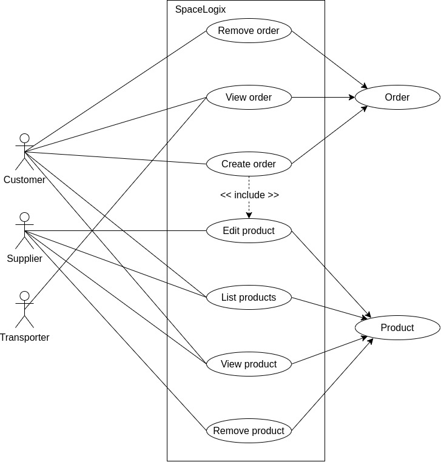
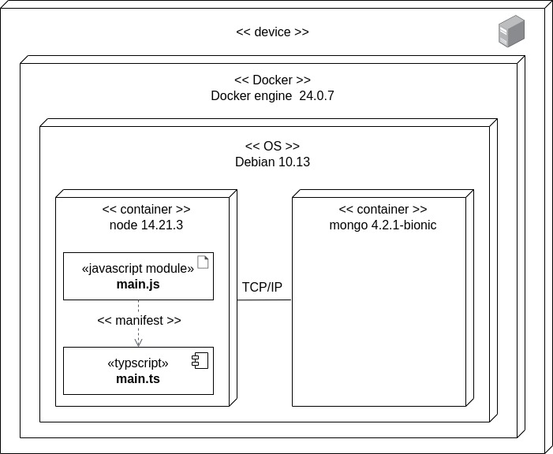

# SpaceLogix

- [Project description](#project-description)
  - [Architecture](#architecture)
  - [Features](#features)
- [Requirements](#requirements)
- [User guide](#user-guide)
  - [Endpoints](#endpoints)
  - [MongoDB document schemas](#mongoDB-document-schemas)
- [Install guide](#install-guide)
  - [Containers](#containers)
  - [Run tests](#run-tests)
- [Comments](#comments)
- [License](#license)
- [Author](#author)

## Project description

SpaceLogix is a cutting-edge logistics system that specializes in managing and optimizing space-related operations with the power of RESTful APIs.

### Architecture

#### Use cases



#### Deployment



### Features

For see full documentation, please visit [SpaceLogix API docs](https://documenter.getpostman.com/view/11299055/2s9YsJBXwZ#0ed4a3be-cb54-4443-8635-c7f799a4c1aa)

## Requirements

- Node.js version: 14.21.3
- NestJS version: 8.0.0
- Docker version: 24.0.7
- Docker compose version: 2.21.0
- Yarn version: 1.22.21

## User guide

### Endpoints

This API is composed for the following services:

#### Authorization

- `POST /api/v1/auth/signup`
- `POST /api/v1/auth/signin`
- `GET /api/v1/auth/signout`

#### User

- `GET /api/v1/users/me`
- `PATCH /api/v1/users`

#### Product

- `POST /api/v1/products`
- `DELETE /api/v1/products/:productId`
- `PATCH /api/v1/products/:productId`
- `GET /api/v1/products`
- `GET /api/v1/products/:productId`

#### Order

- `POST /api/v1/orders`
- `GET /api/v1/orders/:orderId`
- `GET /api/v1/orders`
- `DELETE /api/v1/orders`

### MongoDB document schemas

#### User Schema

This object is a representation for product user:

```json
{
  "_id": "65a02b00d4c97df504ad5edc",
  "name": "supplier1",
  "email": "supplier1@mailinator.com",
  "hashedPassword": "$2b$10$FRrxHESMToFtDj7USDR5Ke8Oletm7byHW5QcYDsHZBofeM44rIJpy",
  "phone": "98765432",
  "address": "fake st. 123",
  "city": "supplier1 city",
  "country": "supplier1 country",
  "role": "supplier",
  "createdAt": "2024-01-11T17:53:04.311Z",
  "updatedAt": "2024-01-11T17:53:04.311Z",
  "__v": 0
}
```

#### Product schema

This object is a representation for product schema:

```json
{
  "_id": "65a02b39d4c97df504ad5ee3",
  "name": "product 1",
  "description": "product description",
  "price": 1000,
  "currency": "usd",
  "stock": 98,
  "supplier": {
    "name": "supplier1",
    "email": "supplier1@mailinator.com",
    "phone": "98765432",
    "address": "fake st. 123",
    "city": "supplier1 city",
    "country": "supplier1 country"
  },
  "createdAt": "2024-01-11T17:54:01.797Z",
  "updatedAt": "2024-01-11T17:55:16.065Z",
  "__v": 0
}
```

#### Order schema

This object is a representation of order schema:

```json
{
  "_id": "65a02b84d4c97df504ad5eee",
  "products": [
    {
      "name": "product 1",
      "description": "description",
      "price": 1000,
      "currency": "usd",
      "quantity": 2,
      "supplier": {
        "name": "supplier1",
        "email": "supplier1@mailinator.com",
        "phone": "98765432",
        "address": "fake st. 123",
        "city": "supplier1 city",
        "country": "supplier1 country"
      },
      "_id": "65a02b84d4c97df504ad5eef"
    }
  ],
  "customer": {
    "name": "customer1",
    "email": "customer1@mailinator.com",
    "phone": "98765432",
    "address": "fake st. 123",
    "city": "customer1 city",
    "country": "customer1 country"
  },
  "transporter": {
    "name": "transporter1",
    "email": "transporter1@mailinator.com",
    "phone": "98765432",
    "address": "fake st. 123",
    "city": "transporter1 city",
    "country": "transporter1 country"
  },
  "payment": {
    "paymentMethod": "credit",
    "cardNumber": "12345678",
    "expirationDate": "2025-12-31",
    "cvv": "123",
    "billingAddress": {
      "country": "billing country",
      "city": "billing city",
      "address": "fake st. 123",
      "zipCode": "billing zip code"
    },
    "totalAmount": 200,
    "currency": "usd"
  },
  "createdAt": "2024-01-11T17:55:16.079Z",
  "updatedAt": "2024-01-11T17:55:16.079Z",
  "__v": 0
}
```

## Install guide

Below are the instructions to install and run the project in development mode.

```bash
git clone https://github.com/christophermontero/spacelogix.git
cd spacelogix
```

Make sure you have MongoDB running before start the project in development mode.

```bash
yarn start:dev
```

### Run tests

For run unit tests use the following command.

```bash
yarn test
```

### Containers

This project supports Docker. To use the API with containers, follow these steps:

1. Ensure you have Docker and Docker Compose installed on your system.

2. Set the database connection in the app.module.ts file to: mongodb://mongodb:27017/spacelogixdb.

3. Run the following commands:

```bash
docker compose -f docker.compose.yml -f docker-compose.dev.yml up -d
```

And for production run the following:

```bash
docker compose -f docker.compose.yml -f docker-compose.prod.yml up -d
```

For stop the containers run the following:

```bash
docker compose -f docker.compose.yml -f docker-compose.dev.yml stop
```

And for destroy the services use the following command:

```bash
docker compose -f docker.compose.yml -f docker-compose.dev.yml down
```

## Comments

If you have any feedback, please reach out at cgortizm21@gmail.com

## License

This project is under [Apache License](https://www.apache.org/licenses/LICENSE-2.0).

## Author

- [@christophermontero](https://github.com/christophermontero)
